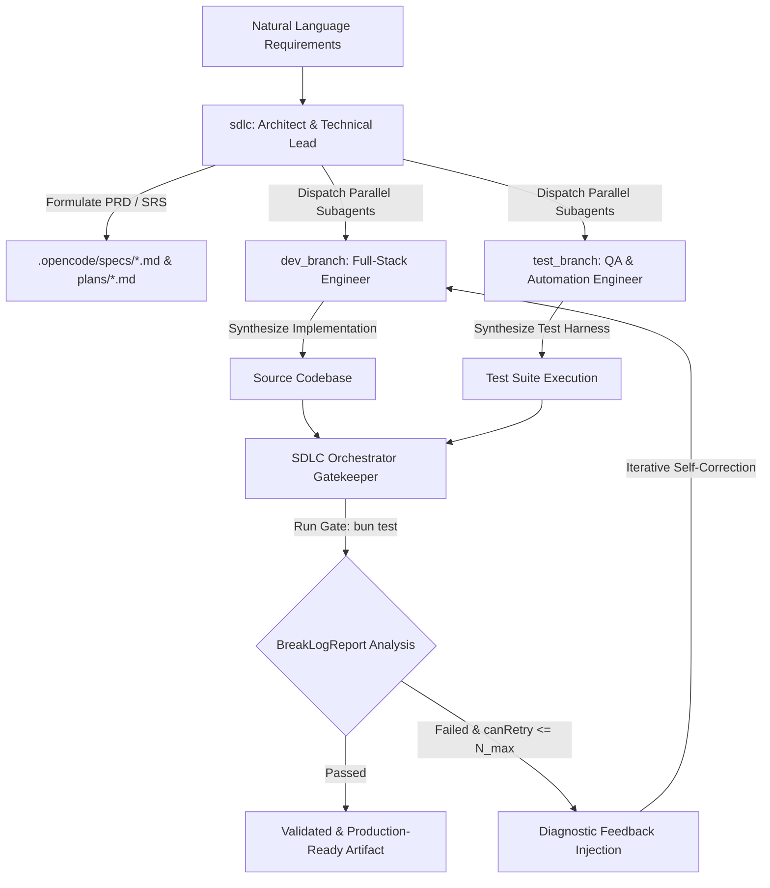

# memoriX: A Multi-Agent Software Development Life Cycle (SDLC) Orchestration Framework

<p align="center">
  
  
  
  
</p>

---

## 1. Abstract

Autonomous code generation using Large Language Models (LLMs) frequently encounters cognitive degradation, compounding syntax regressions, and architectural drift over extended execution trajectories. **memoriX** introduces a structured, hierarchical multi-agent Software Development Life Cycle (SDLC) orchestration framework. By systematically decoupling architectural specification, parallelized code implementation, and formal verification across distinct specialized subagents—coupled with an automated closed-loop validation gatekeeper—memoriX converts ambiguous natural language requirements into deterministically verified, production-grade software artifacts without human intervention during execution.

---

## 2. System Architecture & Formal Methodology

memoriX replaces monolithic coding agent sessions with a coordinated multi-agent topology supported by deterministic verification gates.



### 2.1 Hierarchical Multi-Agent Decomposition

The core execution topology is governed by specialized agents defined in `packages/opencode/src/agent/agent.ts`:

1. **`sdlc` (Architect & Technical Lead Agent)**
   * **Role**: Primary orchestration controller.
   * **Methodology**: Formulates structured Software Requirements Specifications (SRS) and Product Requirement Documents (PRD) durably persisted under `.opencode/specs/` and `.opencode/plans/`. It decomposes system goals into directed task graphs, enforcing architectural boundaries before delegating work to implementation subagents.

2. **`dev_branch` (Implementation Subagent)**
   * **Role**: Specialized software engineering subagent.
   * **Methodology**: Operates on targeted feature branches to execute code generation, structural refactoring, and module integration in strict alignment with the specifications emitted by the `sdlc` agent.

3. **`test_branch` (Verification & Quality Assurance Subagent)**
   * **Role**: Dedicated test synthesis subagent.
   * **Methodology**: Generates comprehensive unit and integration test harnesses (`bun test`) designed to formally verify the invariants specified in the architectural plans, operating independently of the implementation subagent to prevent cognitive bias.

### 2.2 Closed-Loop Validation Gatekeeper (`sdlc-orchestrator`)

To eliminate uncontrolled hallucination loops, memoriX incorporates a deterministic verification pipeline (`packages/opencode/src/session/sdlc-orchestrator.ts`).

Let $T$ denote the test harness execution command (by default, `bun test`). For each execution iteration $i \in \{1, 2, \dots, N_{\max}\}$:
1. The orchestrator executes $T$ in the target working directory and captures standard output ($\text{stdout}$) and standard error ($\text{stderr}$).
2. A diagnostic parser (`analyzeTestOutput`) constructs a structured verification report $R = \langle \text{passed}, \text{canRetry}, \text{diagnostics} \rangle$.
3. If $R.\text{passed} \equiv \text{true}$, the orchestration pipeline terminates successfully ($\text{status: "END"}$).
4. If $R.\text{passed} \equiv \text{false}$ and $R.\text{canRetry} \equiv \text{true}$ (where $i \le N_{\max}$), exact diagnostic failure logs are fed back into the subagent context window for precise, localized self-correction.

---

## 3. Deployment & Standalone Distribution

memoriX is engineered to support both turnkey end-user deployment and rigorous academic/scientific experimentation.

### 3.1 Standalone Desktop Application (End-User Distribution)

For empirical evaluation or practical usage without dependency constraints, memoriX compiles into a self-contained, pre-packaged executable:

* **Executable Artifact**: `packages/desktop/dist/opencode-desktop-win-x64.exe` *(Windows x64)*
* **Runtime Characteristics**:
  * **Zero External Dependencies**: Embedded Electron runtime and Node.js engine eliminates the need for host-installed Node.js, Bun, Python, or Git.
  * **Embedded High-Performance Sidecar**: The local API backend (`virtual:opencode-server`) and compiled WebAssembly parsers (`web-tree-sitter`) run natively inside the application process.
  * **Immediate Execution**: End-users install the `.exe` artifact, point the application to any local repository path, configure an LLM provider (Anthropic, OpenAI, OpenRouter, or local Ollama instances), and immediately instantiate `sdlc` orchestration sessions.

### 3.2 Global Command-Line Interface (CLI)

For researchers operating inside terminal environments or automated CI/CD evaluation pipelines, memoriX can be bound as a global terminal command (`opencode`), accessible across any directory path in the host filesystem.

---

## 4. Repository Structure & Component Taxonomy

The framework is organized as a modular TypeScript monorepo managed via Bun:

| Module / Path | Architectural Function |
| :--- | :--- |
| `packages/desktop/` | **Standalone Electron Desktop Application**; manages window state, IPC communication, sidecar lifecycle, and cross-platform packaging (`electron-builder`). |
| `packages/app/` | **Renderer UI / Frontend** built with SolidJS and Vite; delivers high-responsiveness chat interfaces, real-time agent selectors, and diff visualizations. |
| `packages/opencode/` | **Core Runtime Engine & CLI**. Houses the session state machines, tool definitions, and HTTP API server. |
| ├── `src/agent/` | Formal definitions (`agent.ts`) and system prompt formulations (`sdlc.txt`, `dev-branch.txt`, `test-branch.txt`). |
| ├── `src/session/` | Implementation of `sdlc-orchestrator.ts` and the iterative gatekeeping execution logic (`runGate`). |
| └── `script/` | Build scripts, including `build-node.ts` for bundling the self-contained sidecar runtime (`dist/node/node.js`) and `.wasm` assets. |
| `packages/server/` | HTTP server handlers, routing logic, and WebSocket communication adapters. |
| `packages/core/` | Foundational domain primitives, configuration schemas, SQLite/Drizzle local storage layer, and permission policies. |

---

## 5. Build Instructions & Experimental Setup

To reproduce the environment, modify system prompts, or compile custom executable distributions from source:

### Prerequisites
* **Bun Runtime**: Version 1.3.14 or later ([https://bun.sh](https://bun.sh))
* **Platform Shell**: PowerShell (Windows) or Bash (Unix)

### 5.1 Workspace Initialization
Clone the repository and install all monorepo dependencies:
```bash
git clone https://github.com/anomalyco/opencode.git memoriX # Or target repository URL
cd memoriX
bun install
```

### 5.2 Interactive Development Execution
Launch the Electron desktop interface with live hot-reloading and real-time backend sidecar logging:
```bash
bun run desktop
```

### 5.3 Compiling Standalone Executable Bundles (`.exe` / `.dmg`)
To synthesize the standalone desktop distribution after modifying runtime logic or agent behaviors:
```bash
bun run package:desktop
```
> Upon successful build completion, the distributable executable is generated under `packages/desktop/dist/`.

### 5.4 Global CLI Linking
To register the `opencode` command globally across the host terminal environment:
```bash
cd packages/opencode
bun link
```

---

## 6. Attribution & License Note

**memoriX** builds upon the foundational open-source architecture of [OpenCode](https://opencode.ai). This research project substantially extends the core runtime with hierarchical SDLC multi-agent concurrency, automated verification gatekeeping, and specialized prompt topologies. It is developed and maintained independently by the memoriX team and is not directly affiliated with the core OpenCode organization.
